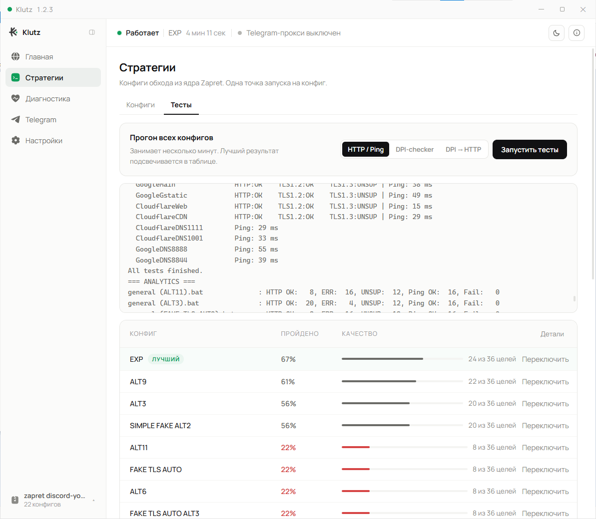
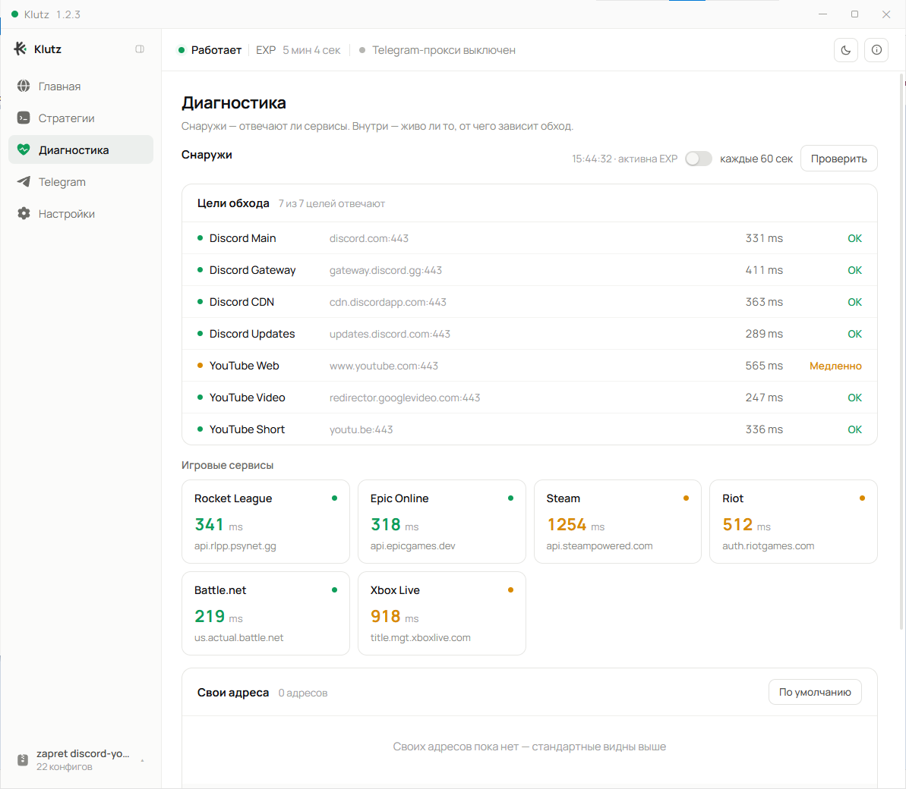
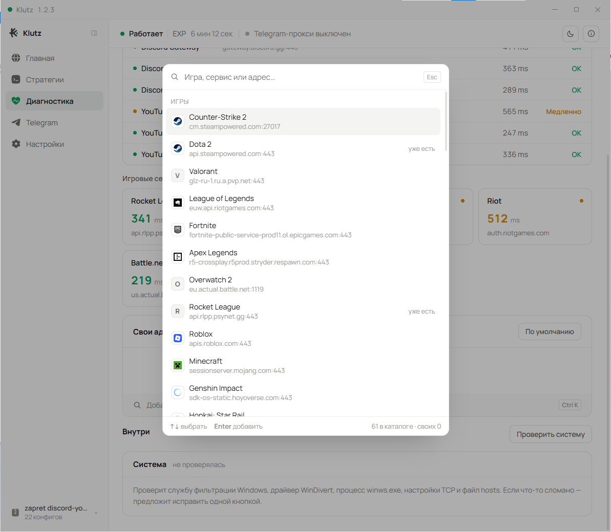
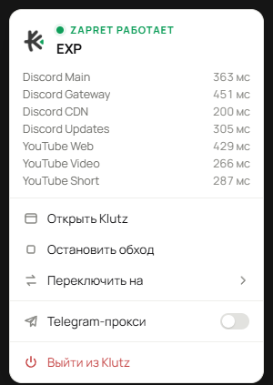

# Klutz

Графическая оболочка для обхода блокировок Discord, YouTube и игровых
сервисов на Windows. Управляет [zapret-discord-youtube](https://github.com/Flowseal/zapret-discord-youtube)
и встроенным [tg-ws-proxy](https://github.com/Flowseal/tg-ws-proxy) для Telegram.

<picture>
  <source media="(prefers-color-scheme: dark)" srcset="docs/main-dark.png">
  
</picture>

Одна кнопка. Klutz сам подбирает рабочую стратегию, следит за связью и
переключается, если она пропала.


Телеметрии нет: Klutz не собирает о вас ничего и никуда не отправляет. Наружу
ходит только за обновлениями — к `api.github.com` и `raw.githubusercontent.com`
за версиями Klutz, zapret и TgWsProxy, за списком ipset и за рекомендованным
`hosts`. Как и у любого запроса, GitHub при этом видит ваш IP.

Интерфейс при этом полностью офлайновый: шрифт лежит внутри приложения
(`src/assets/fonts`), а не подгружается со стороны, и никаких внешних адресов
окно не открывает — это запрещено политикой CSP в `tauri.conf.json`.

## Что умеет

- **Подбор стратегии.** Прогоняет конфиги zapret тестами HTTP/Ping, DPI-checker
  или воронкой DPI → HTTP и включает лучший. Перед прогоном за пару секунд
  проверяет, пробивает ли на этой сети разрез TLS ClientHello вообще — и если
  нет, говорит об этом сразу, а не через двадцать минут перебора.
- **Видит, где режут.** Знать, что цель не отвечает, мало. Klutz стучится в
  тот же адрес с заведомо чистым именем и по разнице отвечает: режут по имени
  (обход поможет), режут адрес (не поможет — нужен туннель или другой адрес)
  или отказывает сам сервер (это вообще не блокировка). Отдельно ловится
  случай, когда рукопожатие прошло, а поток оборвали на середине: снаружи это
  выглядит как «открывается и не грузится», и сменой стратегии не лечится.
  Самолечение всё это учитывает и не гоняет стратегии там, где ни одна не
  спасёт. Проверяется не один адрес цели, а несколько — у Discord и YouTube
  их десятки, и одного мёртвого хватало на ложную тревогу.
- **Следит за связью.** Фоновая проверка Discord и YouTube; если стратегия
  перестала работать — сам переключается на следующую, начиная с той, что
  уже вытаскивала на этой сети, и дальше по рейтингу последнего прогона.
  Раз в несколько дней может прогнать тесты заново, пока никого нет за компьютером.
- **Telegram.** Запускает TgWsProxy и даёт ссылку `tg://proxy` для подключения.
- **Трей.** Статус и цели, переключение стратегии и тумблер Telegram — без окна.
- **Дополнительные стратегии.** Когда ни один штатный конфиг не пробивает,
  одна кнопка кладёт в папку релиза варианты текущего — с другими точками
  разреза и другими приёмами обмана — и убирает их так же. Дальше они живут
  как обычные конфиги: попадают в прогон, в рейтинг и в самолечение.
- Служба Windows, автозапуск при входе, уведомления, диагностика системы,
  обслуживание (ipset, hosts, кэш Discord), экспорт и импорт настроек.

### Как это выглядит

Прогон всех конфигов: слева — живой вывод тестов, ниже — таблица с долей
пройденных целей. Лучший помечен и включается одним щелчком.



Диагностика: отвечают ли цели обхода и игровые сервисы, с пингом по каждой.
Напротив упавшей цели стоит не одинаковое «Нет связи», а причина — «Режут по
имени», «Блок по адресу», «Рвут поток», «Отказ сервера», «Блок по закону» или
честное «Не измерено»; на чём вердикт основан — в подсказке строки.



Свой адрес или сервис добавляется через поиск по Ctrl+K — в каталоге больше
шестидесяти игр и сервисов, иконки подтягиваются с их же сайтов.



Каждый день окно и не нужно: в трее видно пинг по всем целям, там же
переключается стратегия и включается Telegram-прокси.



## Установка

Скачайте `Klutz_X.Y.Z_x64-setup.exe` со [страницы последнего релиза](https://github.com/vbu00/zapret-klutz/releases/latest) и установите.
Нужны Windows 10/11 и права администратора (их требует драйвер WinDivert,
на котором работает zapret). Сам zapret-discord-youtube Klutz скачает или
возьмёт из указанной папки при первом запуске.

Установщик не подписан — SmartScreen может предупредить: «Подробнее» →
«Выполнить в любом случае». Klutz раз в сутки сам проверяет, не вышла ли новая
версия, и подсказывает, где её скачать; новая ставится поверх, настройки сохраняются.

## Сборка из исходников

Нужны [Rust](https://rustup.rs) (MSVC), Visual Studio Build Tools (C++), Node.js.

```
npm install
npx tauri build
```

Установщик появится в `src-tauri/target/release/bundle/nsis/`.

Если сборка падает на линковке из Git Bash: `link.exe` из Git for Windows
перекрывает линкер MSVC. Укажите настоящий в `src-tauri/.cargo/config.toml`
(файл не хранится в репозитории — путь у каждого свой):

```toml
[target.x86_64-pc-windows-msvc]
linker = "C:\\Program Files (x86)\\Microsoft Visual Studio\\2022\\BuildTools\\VC\\Tools\\MSVC\\<версия>\\bin\\Hostx64\\x64\\link.exe"
```

`src-tauri/bin/TgWsProxyHeadless.exe` собирается из зафиксированного снимка
tg-ws-proxy скриптом `tools/tgwsproxy-build/build.ps1`.

## Версии

Semver, история — в [CHANGELOG.md](CHANGELOG.md). Каждый выпуск помечен тегом `vX.Y.Z`.

## Команда Klutz

- **[limeflash](https://github.com/limeflash)**
- **[aleuuu](https://github.com/aleuuu)**
- **[vbu00](https://github.com/vbu00)**

## Благодарности

Огромное спасибо **[Flowseal](https://github.com/Flowseal)** за zapret-discord-youtube
и tg-ws-proxy — Klutz только управляет ими. И [bol-van](https://github.com/bol-van/zapret)
за сам zapret.

Приём «постучаться в тот же адрес с нейтральным именем» описан в мануале
zapret и так же сделан в [z2k](https://github.com/necronicle/z2k) (MIT) —
оттуда же взяты точки разреза для дополнительных стратегий и мысль проверять
не только рукопожатие, но и то, доезжает ли ответ целиком. Движки у нас
разные (`winws` против `nfqws2`), поэтому заимствована логика, а код написан
свой.

## Лицензия

[MIT](LICENSE). tg-ws-proxy распространяется под своей лицензией —
`tools/tgwsproxy-build/LICENSE.tg-ws-proxy`.
